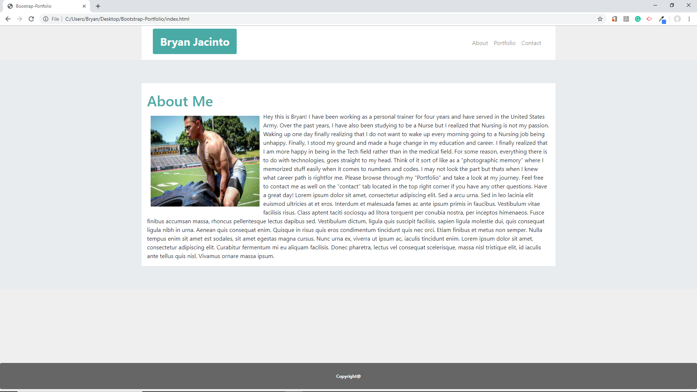

# Bootstrap-Portfolio

## Images


<br>

<br>


<hr>

## Tools Used:

* Visual Studio Code - Open source code editor for building and debugging web and cloud applications.
* HTML - Used to create elements on the DOM.
* CSS - Styles the html elements on page. 
* Git - Version control system to track changes to source code.
* Github - Hosts respository that can be deployed to GitHub pages.
* Bootstrap - An open-source framework for CSS for responsive and mobile front-end development.

<hr>

## Summary

Using Bootstrap nad Visual Studio Codes, I've re-created my original Basic-Portfilio  re-creating three different html files : About me, Portfolio, and Contact by using some of Bootstrap's components such as: Jumbotron, Badges, and cards. Bootstrap helps with its features for mobile-responsiveness so it can fit into small screens such as small tablets, and cellphone devices.

The "About Me" section includes my profile picture to represent myself and a summary explaining what I proudly do in life. 

The "Contact" section includes: Name, Email, and Message; along with text boxes by using the forms commands to allow users to type in their information.

The "Portfolio" includes different pictures that represents me, myself, and I for viewers to see my journey through my photos.

<hr>

## Code Snippet

About me:
```html

 <body style="background-color: #efefef">
    <div style="text-align:center;"></div>
    <div class="container" style=" background-color: white;">
        <nav class="navbar navbar-expand-lg navbar-light">
            <h1><span class="badge badge-secondary" style="background-color: #4aaaa5; padding:20px;">Bryan
                    Jacinto</span>
            </h1>

            <button class="navbar-toggler" type="button" data-toggle="collapse" data-target="#navbarNavAltMarkup"
                aria-controls="navbarNavAltMarkup" aria-expanded="false" aria-label="Toggle navigation">
                <span class="navbar-toggler-icon"></span>
            </button>
            <div class="collapse navbar-collapse" id="navbarNavAltMarkup">
                <div class="navbar-nav ml-auto">
                    <a class="nav-item nav-link" href="index.html">About</a>
                    <a class="nav-item nav-link" href="portfolio.html">Portfolio</a>
                    <a class="nav-item nav-link" href="contact.html">Contact</a>

                </div>
            </div>
        </nav>
    </div>

    <div class="jumbotron jumbotron-fluid">
        <div class="container" style="background-color: white">


            <br>
            <h1 style="color: #4aaaa5;">About Me</h1>


            <div class="row">

                <div class="col-md-12">

                    


                    <p> Hey this is Bryan! I have been working as a personal trainer for four years and have served
                        in
                        the
                        United
                        States
                        Army. Over the past years, I have also been studying to be a Nurse but I realized that
                        Nursing
                        is not my
                        passion. Waking up one day finally realizing that I do not want to wake up every morning
                        going
                        to a
                        Nursing
                        job
                        being unhappy. Finally, I stood my ground and made a huge change in my education and career.
                        I
                        finally
                        realized
                        that I am more happy in being in the Tech field rather than in the medical field. For some
                        reason,
                        everything
                        there is to do with technologies, goes straight to my head. Think of it sort of like as a
                        "photographic
                        memory"
                        where I memorized stuff easily when it comes to numbers and codes. I may not look the part
                        but
                        thats
                        when I
                        knew
                        what career path is rightfor me. Please browse through my "Portfolio" and take a look at my
                        journey.
                        Feel
                        free
                        to contact me as well on the "contact" tab located in the top right corner if you have any
                        other
                        questions.
                        Have
                        a great day!
                        Lorem ipsum dolor sit amet, consectetur adipiscing elit. Sed a arcu urna. Sed in leo lacinia
                        elit
                        euismod ultricies at et eros. Interdum et malesuada fames ac ante ipsum primis in faucibus.
                        Vestibulum
                        vitae facilisis risus. Class aptent taciti sociosqu ad litora torquent per conubia nostra,
                        per
                        inceptos
                        himenaeos. Fusce finibus accumsan massa, rhoncus pellentesque lectus dapibus sed. Vestibulum
                        dictum,
                        ligula quis suscipit facilisis, sapien ligula molestie dui, quis consequat ligula nibh in
                        urna.
                        Aenean
                        quis consequat enim. Quisque in risus quis eros condimentum tincidunt quis nec orci. Etiam
                        finibus et
                        metus non semper. Nulla tempus enim sit amet est sodales, sit amet egestas magna cursus.
                        Nunc
                        urna ex,
                        viverra ut ipsum ac, iaculis tincidunt enim. Lorem ipsum dolor sit amet, consectetur
                        adipiscing
                        elit.
                        Curabitur fermentum mi eu aliquam facilisis. Donec pharetra, lectus vel consequat
                        scelerisque,
                        massa
                        nisl tristique elit, id iaculis ante tellus quis nisl. Vivamus ornare massa ipsum.
                    </p>
                </div>
            </div>
        </div>
    </div>
    </div>
    </div>
    <br><br><br><br>
    <h6><span id="footer1" class="badge badge-secondary"
            style="background-color: #666666; width: 100%; padding: 30px;">Copyright@</span></h6>


```
Contact:
```html
  <body style="background-color: #efefef">

  <div class="container" style=" background-color: white;">
    <nav class="navbar navbar-expand-lg navbar-light">
      <h1><span class="badge badge-secondary" style="background-color: #4aaaa5; padding:20px;">Bryan Jacinto</span>
      </h1>

      <button class="navbar-toggler" type="button" data-toggle="collapse" data-target="#navbarNavAltMarkup"
        aria-controls="navbarNavAltMarkup" aria-expanded="false" aria-label="Toggle navigation">
        <span class="navbar-toggler-icon"></span>
      </button>
      <div class="collapse navbar-collapse" id="navbarNavAltMarkup">
        <div class="navbar-nav ml-auto">
          <a class="nav-item nav-link" href="index.html">About</a>
          <a class="nav-item nav-link" href="portfolio.html">Portfolio</a>
          <a class="nav-item nav-link" href="contact.html">Contact</a>
        </div>
      </div>
  </div>
  </nav>

  <div class="jumbotron jumbotron-fluid" style="height:730px;">
    <div class="container" style="background-color: white; height: 700px;">

      <br>
          <h1 style="color: #4aaaa5;">About Me</h1>
       
      <hr>
      <div class="container">
        <form>
          <div class="form-group">
            <label>Name</label>
            <input class="form-control" type="text">
          </div>

          <div class="form-group">
            <label>Email</label>
            <input class="form-control" type="text">
          </div>

          <div class="form-group">
            <label>Message</label>
            <input class="form-control" type="text" style="height: 300px;">
          </div>
        </form>

        <button class="btn" style="background-color:#4aaaa5; color: white">
          Submit
        </button>
      </div>

    </div>
  </div>


  <br><br><br><br>
  <h6><span class="badge badge-secondary"
      style="background-color: #666666; width: 100%; padding: 30px;">Copyright@</span></h6>
```
Portfolio:
```html
<body style="background-color: #e9e9e9">

    <div class="container" style=" background-color: white">
        <nav class="navbar navbar-expand-lg navbar-light">
            <h1><span class="badge badge-secondary" style="background-color: #4aaaa5; padding:20px;">Bryan
                    Jacinto</span>
            </h1>

            <button class="navbar-toggler" type="button" data-toggle="collapse" data-target="#navbarNavAltMarkup"
                aria-controls="navbarNavAltMarkup" aria-expanded="false" aria-label="Toggle navigation">
                <span class="navbar-toggler-icon"></span>
            </button>
            <div class="collapse navbar-collapse" id="navbarNavAltMarkup">
                <div class="navbar-nav ml-auto">
                    <a class="nav-item nav-link" href="index.html">About</a>
                    <a class="nav-item nav-link" href="portfolio.html">Portfolio</a>
                    <a class="nav-item nav-link" href="contact.html">Contact</a>
                </div>
            </div>
    </div>
    </nav>

    <div class="jumbotron jumbotron-fluid">
        <div class="container" style="background-color: white; height: 1600px;">

            <br>
            <h1 style="color: #4aaaa5;">About Me</h1>

            <hr>
            <hr>

            <div class="row">
                <div class="col-md-6">
                    
                    <h3><span id="badge1" class="badge"
                            style="background-color: #4aaaa5; color: white; width: 250px;">Military</span></h3>
                </div>
                <div class="col-md-6">
                    
                    <h3><span id="badge2" class="badge"
                            style="background-color: #4aaaa5; color: white; width: 250px;">Fitness</span></h3>
                </div>


            </div>
            <div class="row">
                <div class="col-md-6">
                    
                    <h3><span id="badge3" class="badge"
                            style="background-color: #4aaaa5; color: white; width: 250px;">Hobbies</span></h3>
                </div>
                <div class="col-md-6">
                    
                    <h3><span id="badge3" class="badge"
                            style="background-color: #4aaaa5; color: white; width: 250px;">Nature</span></h3>
                </div>
            </div>
            <div class="row">
                <div class="col-md-12">
                    
                    <h3><span id="badge3" class="badge"
                            style="background-color: #4aaaa5; color: white; width: 250px;">Travel</span></h3>
                </div>
            </div>
        </div>


        <br><br><br><br>
        <h6><span id="footer3" class="badge badge-secondary"
                style="background-color: #666666; width: 100%; padding: 30px;">Copyright@</span></h6>


```
## Author Links
Linkedin: https://www.linkedin.com/in/bryan-jacinto-100438aa/

Github:
https://github.com/bryanjacinto1994
